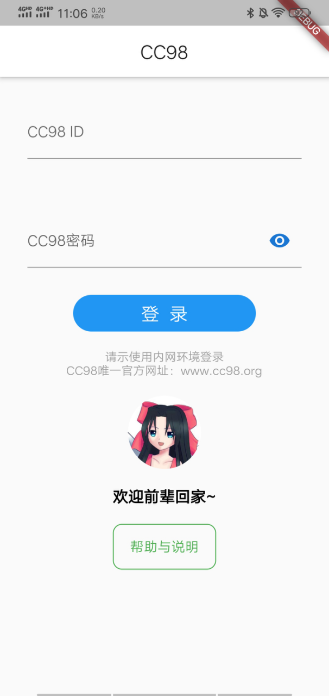
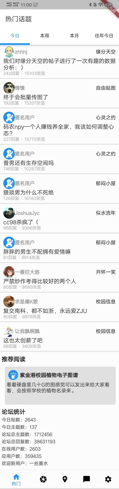
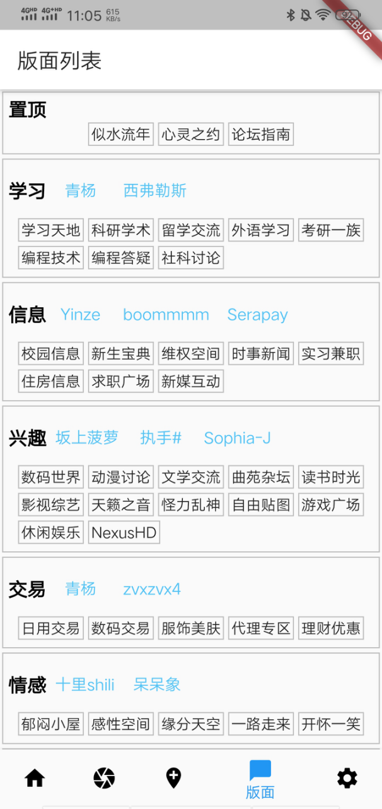
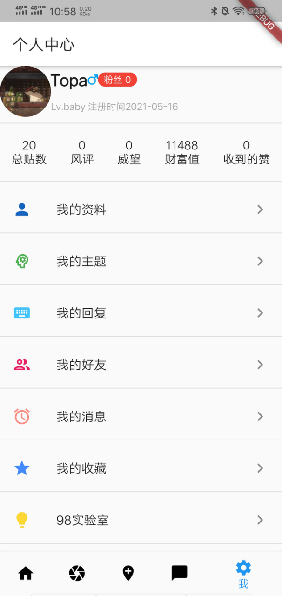

# CC98-APP


### Introduction

+ 基于flutter开发的CC98手机APP

  >  浙江大学CC98论坛，简称“CC98论坛”或“98”，是一个能够联结学生、老师、学校的交流平台，也为以浙大师生为主体的广大网友提供一个网上学习和交流的途径，从中充分展现当代大学生多姿多彩的课余生活和网上文化生活。

+ 基本复现了CC98微信小程序功能

### Envoirment

+ 开发环境：vscode + flutter sdk 

+ 测试环境：

  - 模拟器：android simulator（android studio上下载）

  - 真机：vivo x21

### Technical points

+ bbcode解析（bbcode是cc98网站内容所用的标记语言）
+ 搜索历史
+ token机制，登陆cc98

### Build & Run

```bash
# 编译
flutter create .
# 运行
flutter run
# 热更新直接刷新
r
# 热更新重启刷新
R
# 退出运行模拟器
q
```

### Result

**登录**



**热门**



**新帖**


**版面**



**设置**


